# Acceso a la presentación

##

 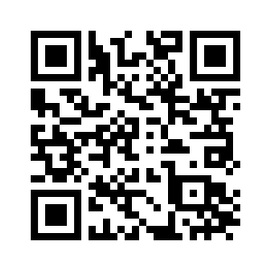 

[https://pbeltran.github.io/2019iceudl](https://pbeltran.github.io/2019iceudl)

# ¿Por qué estadística y por qué probabilidad?

## 

:::::::::::::: {.columns}

::: {.column width="65%"}

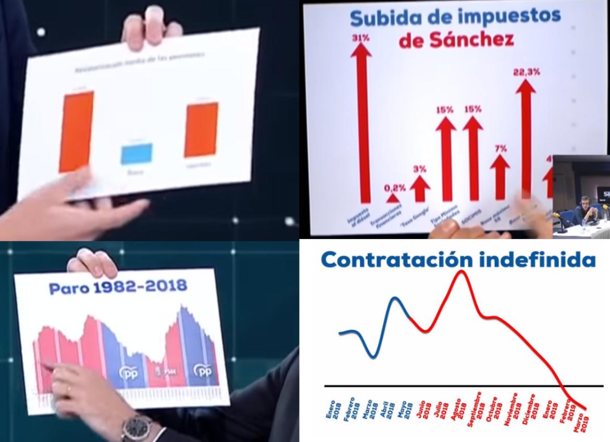
:::

::: {.column width="35%"}

Otra cosa no, pero las elecciones nos traen material de aula de primer orden. 

- _Imágenes de los debates electorales del 28A_
- ¿Qué podemos decir de estas gráficas?

:::
::::::::::::::

## Por ejemplo, una que ha tenido mucho recorrido...

La de Casado...

::: notes
Cuentas de Twitter que analizan gráficos erróneos en los medios o la forma de presentar datos.
\@malaprensa
\@numeroteca

:::

## Casas de apuestas

 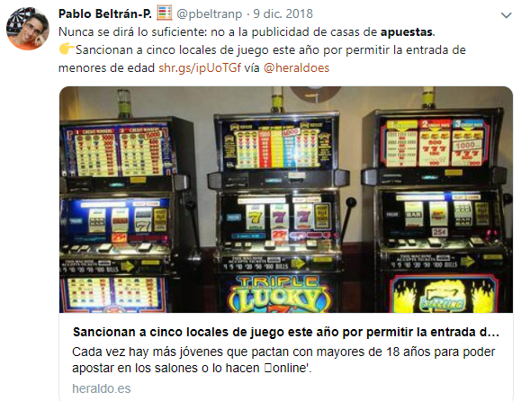 

##

 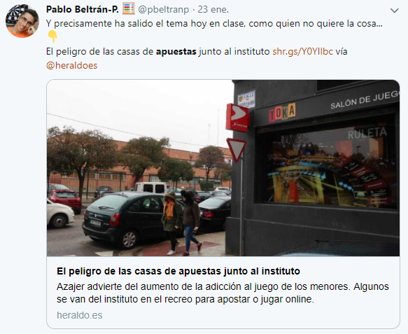 

##

 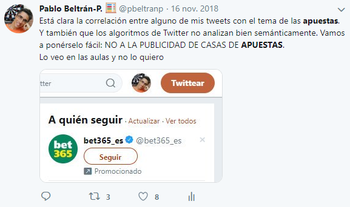 

##

 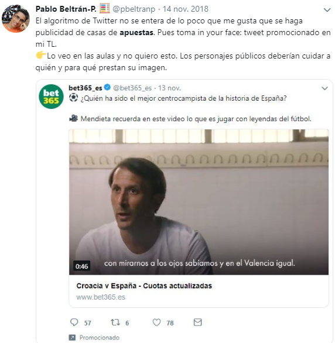 

## Humor

:::::::::::::: {.columns}

::: {.column width="55%"}

 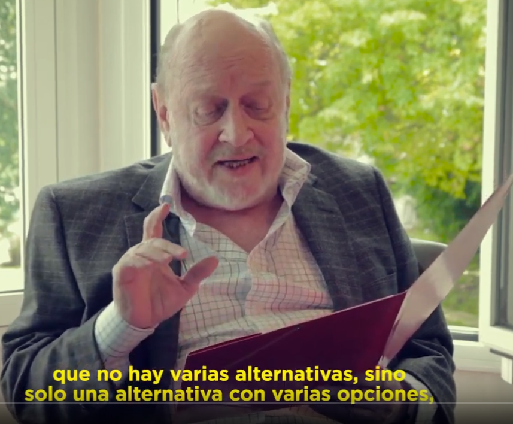 

[Enlace al vídeo del \#CILE2019](https://www.youtube.com/watch?v=2NDxV3q-fEo)

:::

::: {.column width="45%"}

Marcos Mundstock (_Les Luthiers_) en el VIII Congreso Internacional de la Lengua Española.

No hay varias alternativas, sino solo *una alternativa* con varias *opciones*.

:::
::::::::::::::

::: notes
Les Luthiers siguen proporcionando pequeñas joyas para la educación matemática. Véase, o escúchese, el Teorema de Thales, opus 48... de Johann Sebastian Mastropiero.
:::

## En definitiva

Como el resto de las matemáticas, la estadística y la probabilidad nos permiten participar y disfrutar del mundo en que vivimos.

::: notes

Mejor que mundo, sería decir "sociedad". Estadística, etimología, estado. 

:::

# Somos algoritmos

## Una lectura interesante

:::::::::::::: {.columns}

::: {.column width="35%"}

 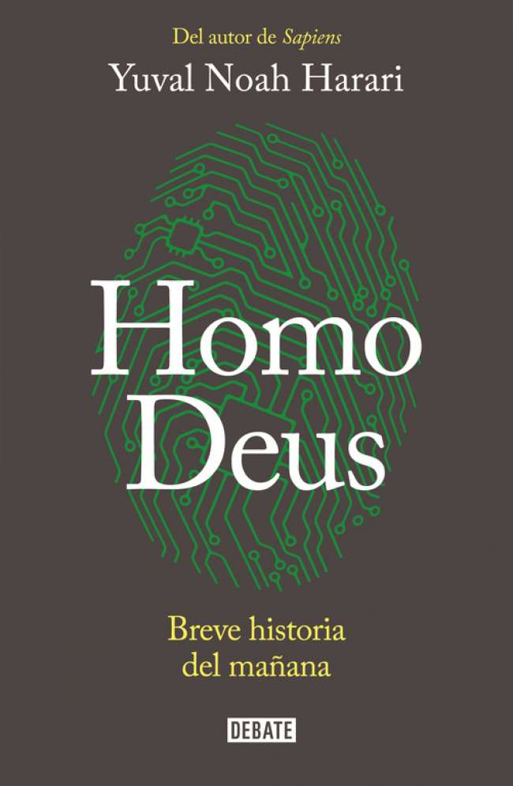 
:::

::: {.column width="55%"}

Yuval Noah Harari 

:::
::::::::::::::

## Una historia ...

:::::::::::::: {.columns}
::: {.column width="60%"}

Un babuino ve unas bananas que cuelgan de un árbol, pero también se da cuenta de que un león acecha en las inmediaciones. ¿Debería el babuino arriesgar su vida por esas bananas?

. . .

La situación se reduce a un problema matemático de cálculo de probabilidades: la probabilidad de que el babuino muera de hambre si no come las bananas frente a la probabilidad de que el león atrape al babuino.

Para resolver este problema, el babuino necesita tener en cuenta muchos datos: «¿Qué distancia me separa de las bananas? ¿Y del león? ¿A qué velocidad puedo correr? ¿A qué velocidad

:::
::: {.column width="40%"}
Probando

:::
::::::::::::::

::: notes

:::

# ¿Fácil o dificil?

##

:::::::::::::: {.columns}

::: {.column width="45%"}

 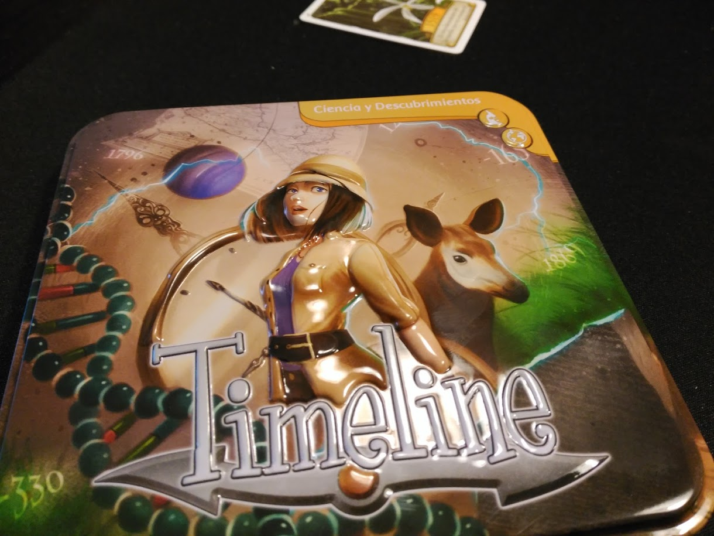 

:::
::: {.column width="45%"}
 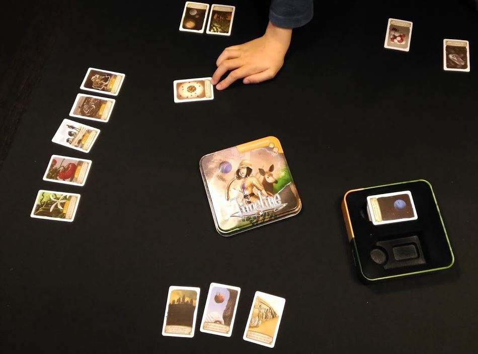 
:::
::::::::::::::

## Veamos

Encuesta...

# Algunas orientaciones

## El azar diferencia este tipo de situaciones
:::::::::::::: {.columns}

::: {.column width="35%"}

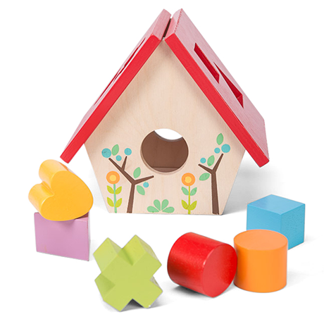

:::
::: {.column width="35%"}

:::incremental
- Proporcionar una amplia variedad de experiencias que permitan observar los fenómenos aleatorios y diferenciarlos de los deterministas.
- Estimular la expresión de predicciones sobre el comportamiento de estos fenómenos y los resultados, así como su probabilidad.

:::

:::
::::::::::::::

:::notes

:::

## 

:::incremental
- Organizar la recogida de datos de experimentación de modo que los alumnos tengan posibilidad de contrastar sus predicciones con los resultados producidos y revisar sus creencias en función de los resultados.
- Resaltar el carácter imprevisible de cada resultado aislado, así como la variabilidad de las pequeñas muestras, mediante la comparación de resultados de cada niño o por parejas.
- Ayudar a apreciar el fenómeno de la convergencia mediante la acumulación de  resultados de toda la clase y comparar la fiabilidad de pequeñas y grandes muestras.
:::

# No enseñes matemáticas a la manera "inteligente"
## Si eres bueno en mates, es que eres muy inteligente
Un post de @ddmeyer: [http://blog.mrmeyer.com/2019/dont-teach-math-the-smart-way/](http://blog.mrmeyer.com/2019/dont-teach-math-the-smart-way/)

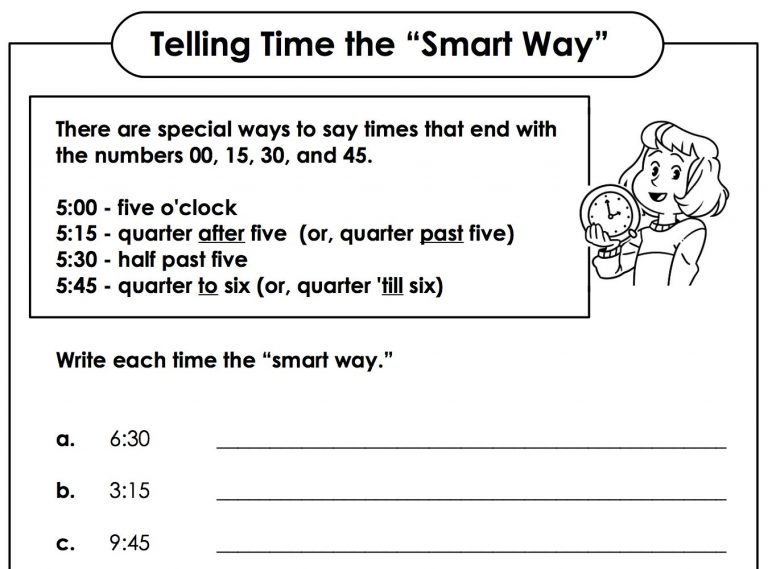

## ¿Por qué no así?

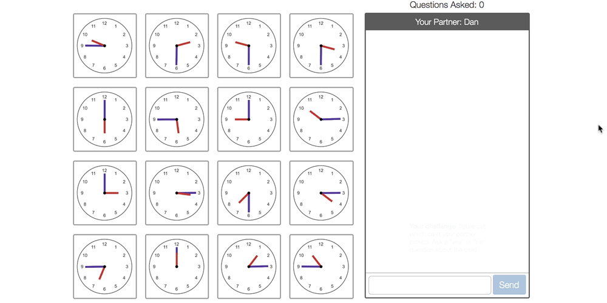

[Enlace a la actividad de Desmos](https://teacher.desmos.com/polygraph/custom/5c9d3a222ab03627ab029c12)

## ¿Por qué no así? (continuación)

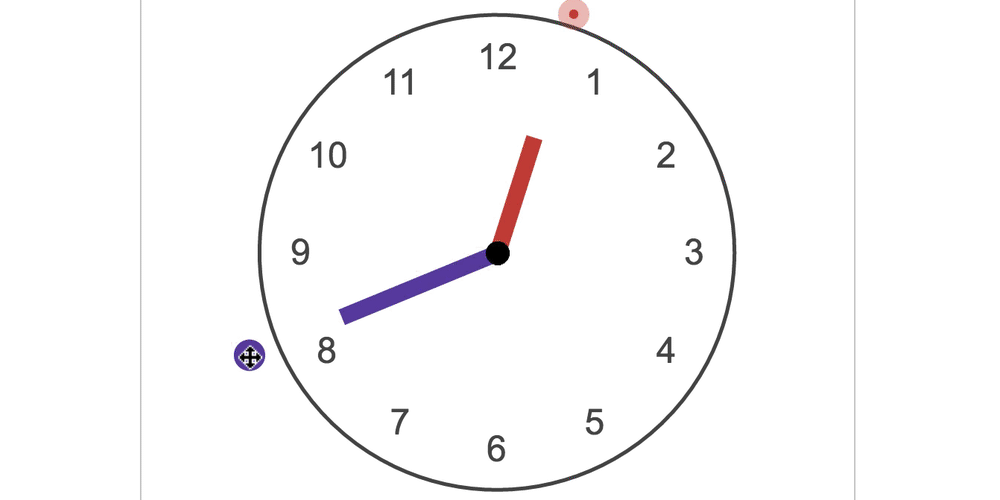

[Enlace a la actividad de Desmos](https://teacher.desmos.com/activitybuilder/custom/5c915c7f1957670c4053bd4e)

## 

>"Defining _smartness_ narrowly is to define _dumbness_ broadly. Instead, we should seek to find smartness as often as possible in as many students as possible". (@ddmeyer)

# Juegos y sorteos

##

Algunos de estos juegos contribuyen a la formación de creencias, como, por ejemplo, que el número cinco es el más difícil, cuando se lanza un dado. Todas estas actividades se podrían aprovechar en relación con
la introducción de la probabilidad

# Experimentación y estimación frecuencial de probabilidades

## 
En este tipo de actividades se proporciona a los alumnos algunos dispositivos generadores de resultados aleatorios, como dados, monedas, fichas, ruletas, etc. La finalidad será que los alumnos experimenten y adquieran una experiencia de lo aleatorio, incluyendo la observación de la imprevisibilidad de resultados, la variabilidad de las pequeñas muestras y la convergencia gradual a la probabilidad teórica. Será necesario que el profesor organice la recogida de datos, la representación gráfica de los resultados y la discusión de los mismos. Se animará a los alumnos a expresar sus creencias previas sobre los fenómenos aleatorios y a contrastarlas con los resultados experimentales. La recogida de datos, organización en tablas y representación gráfica permite conectar este tema con la estadística.

#  Construcción de dispositivos aleatorios 

## Construcción de dispositivos aleatorios 

:::::::::::::: {.columns}
::: {.column width="60%"}

- Construir dispositivos aleatorios (dados, ruletas, etc.) con resultados tanto equiprobables como no equiprobables. 

:::incremental
- Objetivos:
	* Distinguir los casos en que es posible o no es posible aplicar el **principio de indiferencia**.
	* Apreciar la utilidad de la **estimación frecuencial** de la probabilidad.
- Conexiones intra y extra-curriculares
	* Poliedros regulares y no regulares, desarrollos.
	* Sector circular.
	* Modelado 3D
:::
:::
::: {.column width="30%"}

:::
:::::::::::::

## Con papel, tijeras y pegamento...

:::::::::::::: {.columns}
::: {.column width="55%"}

1. Construye un dado en cartulina, pero numera dos caras con el cinco y ninguna con el uno.
2. Experimenta con este dado. Enumera, para este caso, el conjunto de todos los resultados posibles. ¿Cuáles son sus probabilidades?

:::

::: {.column width="35%"}

:::

:::::::::::::

:::notes
Actividad tomada de Batanero y Godino (2003)
:::

## Con papel, tijeras y pegamento...

3. Construye otro dado y pega un pequeño peso en la cara del uno (un botón). Así tenemos un dado sesgado.

:::incremental

4. ¿Qué consecuencias tiene el hecho de que una cara del dado pese más que las restantes? En este caso, obtener un 1, ¿es más, menos o igual de probable que antes? ¿Puedes construir un dado sesgado de tal manera que casi siempre salga el 5?
5. Construye dados sesgados y no sesgados que tengan más de 6 resultados posibles. Construye dados sesgados y no sesgados con poliedros regulares. ¿Cuáles son los poliedros regulares con los que puedes construir dados no sesgados? ¿Podrías construir un dado no sesgado con un poliedro no regular?
:::

. . .

  

:::notes
Actividad tomada de Batanero y Godino (2003)
:::

## ¿Y sin pegamento?

:::::::::::::: {.columns}
::: {.column width="55%"}
- Origami modular.
- Gran potencial.
:::

::: {.column width="35%"}

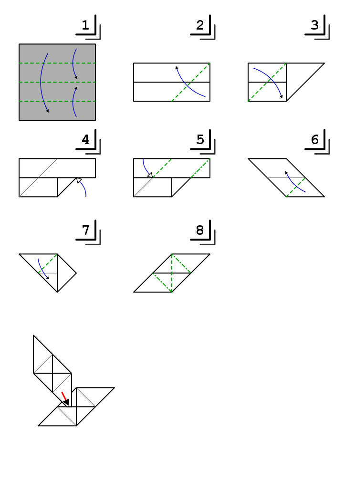
Módulo Sonobe
:::

:::::::::::::

:::notes

:::

# Con software de modelado en 3D

## 

:::::::::::::: {.columns}
::: {.column width="55%"}
 - Modelado e impresión 3D como recurso didáctico en el aprendizaje de la probabilidad.

:::
::: {.column width="35%"}

:::
:::::::::::

## Consigna de la tarea

>La tarea consiste en diseñar un dado con ordenador. Es voluntario y añade 0,5 puntos al examen de geometría. Después, imprimiré en 3D vuestros dados, que os podréis quedar, y os pediré que los probéis para ver si están o no sesgados. 

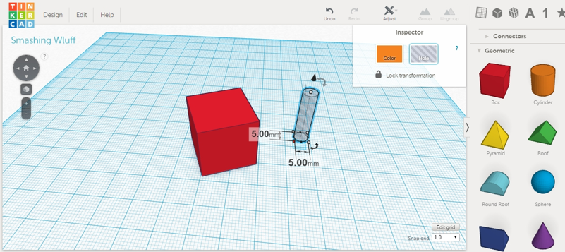

## Tras unos días...
- Plazo de una semana para la entrega de los diseños, recogiendo finalmente las producciones de 10 alumnos. 

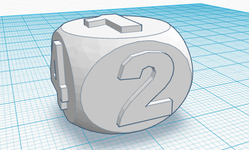

Dado con las esquinas redondeadas (forma básica)

## Dado imprimiéndose

- ¿Es este el dado que diseñaste? ¿Te gusta cómo ha quedado?
- ¿Lo usarías para jugar a algún juego de mesa?
- ¿Cómo sabrías si es un buen dado? ¿Hacemos la prueba?

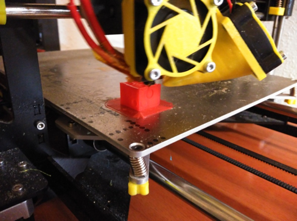

## No es fácil diseñar un dado
**Debates en la comunidad maker**

- Los dados con esquinas más redondeadas, evidentemente, ruedan más. Esto es algo que amplifica cualquier sesgo de diseño, lo que constituye una ventaja de cara a nuestros objetivos.
- Si colocamos el dado para que se imprima girado 45º, obtenemos mejores resultados.
- El porcentaje de relleno de los dados influye. El software traductor permite ahorrar plástico, rellenando el interior de la pieza con un mallado rectangular o hexagonal. Se comprueba que es mejor imprimir dados sólidos al 100%.
[Ver hilo en thingiverse](http://www.thingiverse.com/thing:147883/#comments)

## Resultados (tipos de errores)

1. Cuando se indican los puntos con cavidades, no se ha retirado la misma cantidad de material en todas las caras, por lo que unas caras pesan más que otras.
2. Un error similar se produce cuando en lugar de retirar material, se añade, con lo que se propicia que se mantenga sobre ciertas caras mayor masa que en otras. 
3. No se tiene en cuenta que la suma de las puntuaciones de las caras debería sumar 7 para facilitar el equilibrado del dado (esto está relacionado con el error de tipo 2), como ocurre en los dados estándar.
4.  No se centran o alinean los puntos de cada cara, lo cual influye también en la distribución de masa del dado.
5.  El dado no presenta las mismas dimensiones en todas sus caras. 

## En el máster de ESO (2017/18)

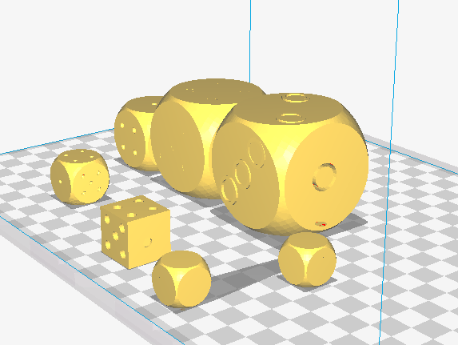

## En la Grecia clásica

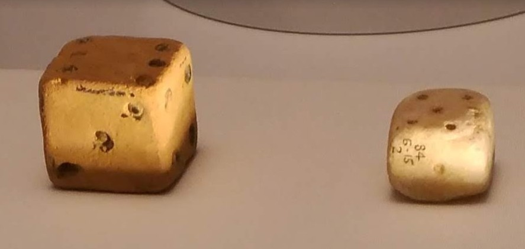

## Resultados no equiprobables: algo muy simple

:::::::::::::: {.columns}
::: {.column width="35%"}

1. Con un clip y un boli

:::

::: {.column width="55%"}

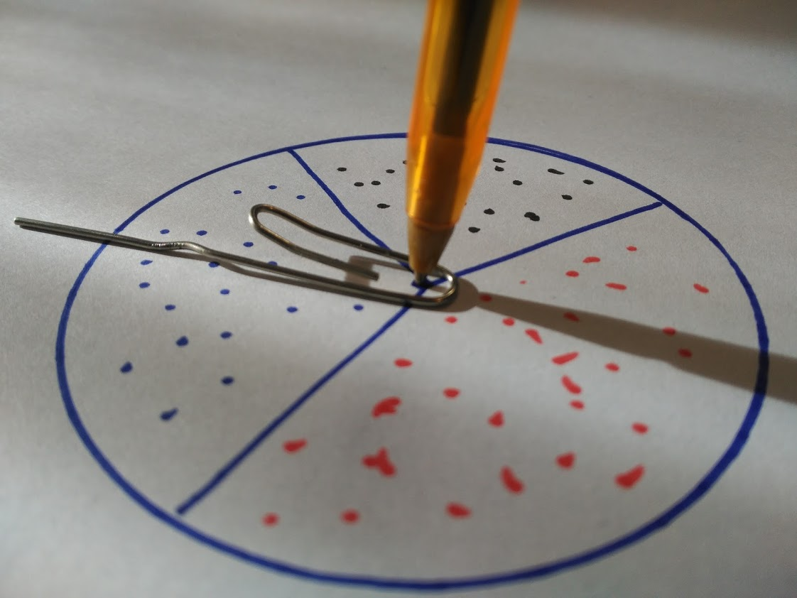

:::

:::::::::::::

# Recursos disponibles en Internet

## Simuladores de experimentos

[Laboratorio básico de Azar, Probabilidad y Combinatoria](http://ntic.educacion.es/w3/eos/MaterialesEducativos/mem2010/labazar/index.html)
 
 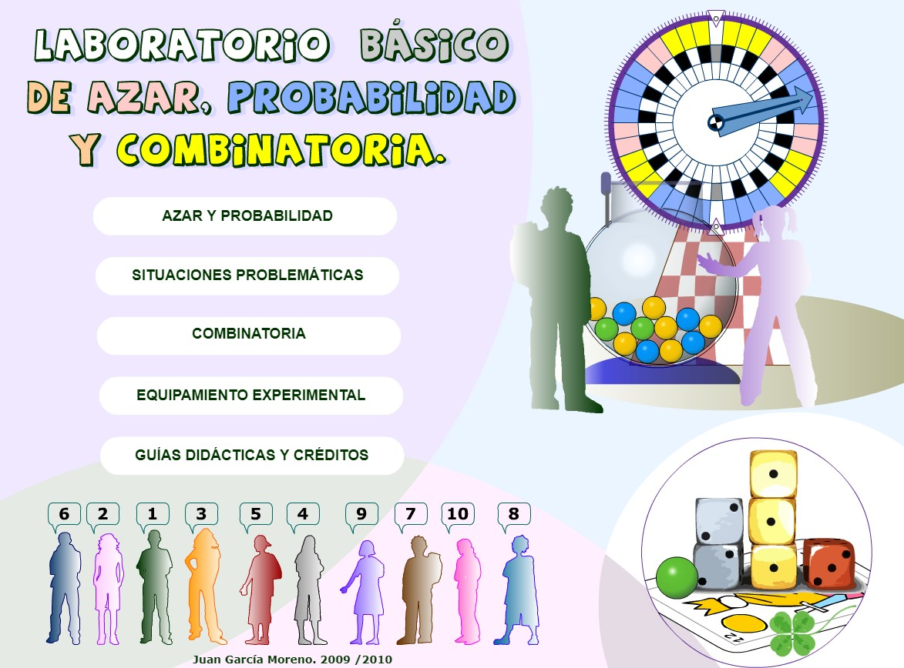
 
## Desmos

# Créditos y referencias

## Lista de referencias

Alsina, Á., & Salgado, M. (2019). [Ampliando los conocimientos matemáticos en Educación Infantil: la incorporación de la probabilidad]( https://doi.org/10.21703/rexe.20191836alsina6). _Revista de Estudios y Experiencias En Educación, 18_(36), 225–240.

Batanero, C., & Díaz, C. (2011). [_Estadística con proyectos_](https://www.ugr.es/~batanero/pages/ARTICULOS/Libroproyectos.pdf). Granada: Universidad de Granada.

Batanero, C., & Godino, J. D. (2003). [*Estocástica y su didáctica para maestros*](https://www.ugr.es/~jgodino/edumat-maestros/manual/6_Estocastica.pdf). Departamento de Didáctica de las Matemáticas. Universidad de Granada.

Beltrán-Pellicer, P. (2017). [Modelado e impresión 3D como recurso didáctico en el aprendizaje de la probabilidad](http://thales.cica.es/epsilon/sites/thales.cica.es.epsilon/files/epsilon95_6.pdf). _Épsilon: Revista de Educación Matemática, 34_(95), 99-106.

##

Beltrán-Pellicer, P. (2017). [Una propuesta sobre probabilidad en educación infantil con juegos de mesa](http://www.edma0-6.es/index.php/edma0-6/article/view/25/22). _EDMA0-6: Educación Matemática en la Infancia, 6_(1), 53-61.

Beltrán-Pellicer, P., Ricart, M., & Estrada, A. (2019). [Una experiencia sobre el diseño de juegos como recurso para desarrollar la competencia didáctico-matemática en probabilidad con docentes de infantil y primaria](https://www.researchgate.net/publication/331435985_Una_experiencia_sobre_el_diseno_de_juegos_como_recurso_para_desarrollar_la_competencia_didactico-matematica_en_probabilidad_con_docentes_de_infantil_y_primaria). En J. M. Contreras, M. M. Gea, M. M. López-Martín, & E. Molina-Portillo (Eds.) Actas del Tercer Congreso Internacional Virtual de Educación Estadística (pp. 1-10).

Godino, J. D., Batanero, C., & Cañizares, M. J. (1987). _Azar y probabilidad_. Madrid: Síntesis. 

Vásquez, C., & Alsina, A. (2019). [Conocimiento especializado del profesorado de educación básica para la enseñanza de la probabilidad](https://doi.org/10.30827/profesorado.v23i1.9160). _Profesorado, Revista de Currículum y Formación Del Profesorado, 23_(1), 393-419. 

## Créditos

Compartir el conocimiento de forma libre es una buena práctica. 

En esta presentación se han utilizado materiales disponibles en abierto y se han citado las fuentes correspondientes. El contenido de esta presentación está publicado con licencia Creative Common [CC-BY-SA-4.0](https://creativecommons.org/licenses/by-sa/4.0/legalcode.es), lo que quiere decir que puedes compartirla y adaptarla, pero tienes que citarme (Pablo Beltrán-Pellicer) y poner un enlace a esta presentación. 

Siéntete libre de trabajar con este material y de contactar conmigo para compartir tus reflexiones.

-----

Presentación realizada con  <a href="https://revealjs.com/#/">Reveal.js</a>, <a href="https://pandoc.org/">Pandoc</a>, <a href="https://www.mathjax.org/">MathJax</a> y <a href="https://www.markdownguide.org/">Markdown</a>

## 

Images 
Most of the diagrams and stuff are self-made (CC license like above). 

The icons/logos are from flaticon.com published under CC license as well: Stackoverflow, Github, Linkedin, Xing, GCFA, GCNA. 

The background images are from flickr.com published under CC license as well: knitting needles, Fun With Bike Lights 2, The Beauty of Mathematics, SIS building, Long road, Green, Money.

## 

